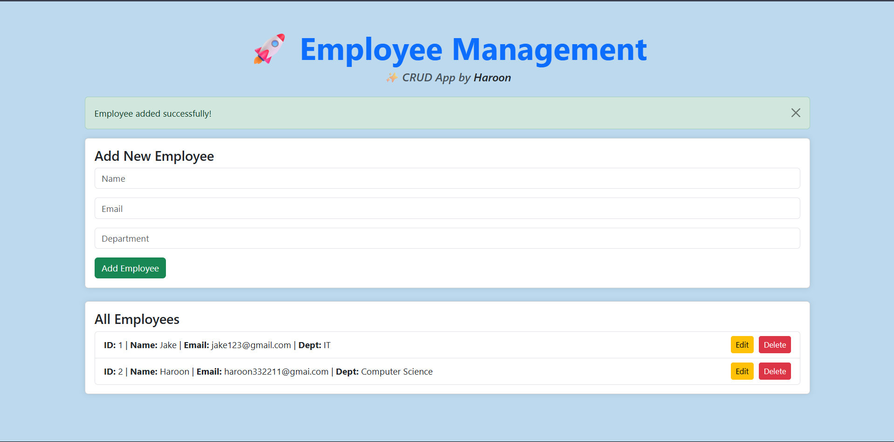

---

# 🚀 Employee Management CRUD App (Flask)

This is a simple yet functional **Employee Management System** built with **Flask**, allowing you to:

* ✅ Add new employees
* 📝 Edit employee details
* ❌ Delete employees
* 👀 View all employees
* ✅ Flash validation for inputs
* 🎨 Styled using **Bootstrap 5**

> 💻 Developed by **Haroon**

---

## 🧠 Tech Stack

* **Python 3**
* **Flask**
* **SQLite (via SQLAlchemy)**
* **Bootstrap 5 (CDN)**

---

## 📁 Project Structure

```
CRUD-App-Flask/
│
├── venv/                # Virtual Environment
├── app.py               # Main Flask App / Routes
├── models.py            # SQLAlchemy Models
├── templates/
│   └── index.html       # Single Page for Add/Edit/View
├── static/              # (optional) Static files (CSS/JS)
├── requirements.txt     # Dependencies (optional)
└── README.md            # This file
```

---

## 🔧 Setup Instructions

1. **Clone the Repository**

   ```bash
   git clone https://github.com/your-username/CRUD-App-Flask.git
   cd CRUD-App-Flask
   ```

2. **Create Virtual Environment**

   ```bash
   python -m venv venv
   venv\Scripts\activate  # On Windows
   ```

3. **Install Dependencies**

   ```bash
   pip install flask flask_sqlalchemy
   ```

4. **Run the App**

   ```bash
   python app.py
   ```

5. **Visit in Browser**

   ```
   http://localhost:5000
   ```

---

## ✨ Features

* ✅ Single HTML Page for All Operations
* 🔐 Backend Input Validation (Name, Email, Dept)
* 🚫 Prevent Duplicate Emails
* 🔔 Flash Messages for Feedback
* 🎨 Light Green Background with Modern UI

---

## 📸 Screenshot



---

## 📌 Future Ideas

* ✅ Search functionality
* ✅ Pagination for large datasets
* ✅ Login system for Admin
* ✅ Export to CSV

---

## 👤 Author

* **Haroon Khan**
* GitHub: [@RealHaroon](https://github.com/RealHaroon)

---

## 📃 License

This project is open-source and free to use for educational purposes.

---

