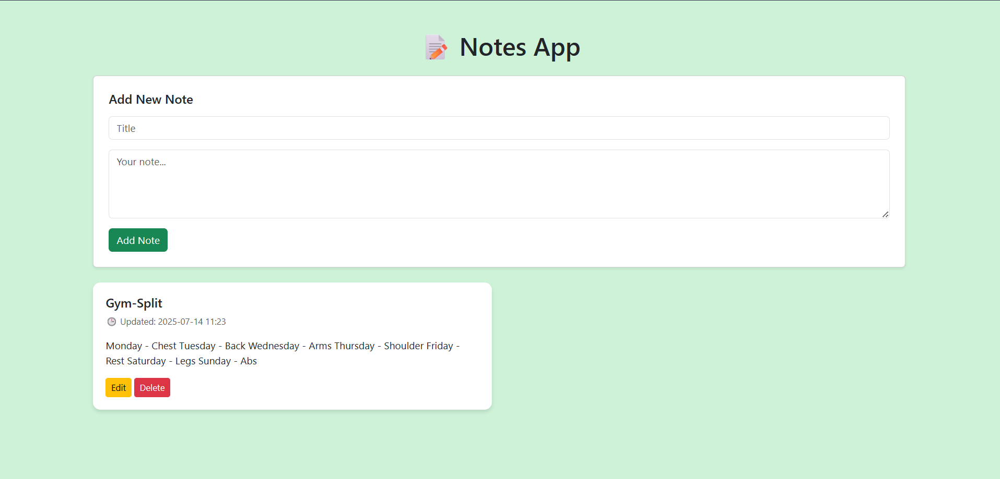

---

## 📝 Flask Notes App

A simple yet powerful **Notes App** built with **Flask** and **SQLite**, where users can:

* ✅ Create notes
* ✏️ Edit existing notes
* ❌ Delete notes
* 🕒 Track creation and update timestamps
* 🎨 Optional: Add tags, styling, or markdown

---

## 📸 Screenshot

> *(Add your screenshot here)*
> Example:
> 

---

## 📁 Project Structure

```
NotesApp/
├── run.py                  # Entry point
├── Components/
│   ├── __init__.py         # App setup and DB init
│   ├── models.py           # Note model
│   ├── routes.py           # App routes
│   └── templates/
│       └── index.html      # Main template
├── static/
│   └── style.css           # Optional custom styling
├── instance/
│   └── notes.db            # SQLite DB (auto-created)
├── README.md
```

---

## 🧱 Tech Stack

* **Backend:** Flask (Python)
* **Database:** SQLite (via SQLAlchemy)
* **Frontend:** HTML5, Bootstrap 5
* **ORM:** SQLAlchemy

---

## ⚙️ Setup Instructions

1. **Clone the repository**

   ```bash
   git clone https://github.com/your-username/Flask-Notes-App.git
   cd Flask-Notes-App
   ```

2. **Create a virtual environment (optional)**

   ```bash
   python -m venv venv
   source venv/bin/activate  # On Windows: venv\Scripts\activate
   ```

3. **Install dependencies**

   ```bash
   pip install flask flask_sqlalchemy
   ```

4. **Run the app**

   ```bash
   python run.py
   ```

5. **Visit in browser**

   ```
   http://127.0.0.1:5000/
   ```

---

## 🧠 Features

| Feature       | Description                  |
| ------------- | ---------------------------- |
| Add Note      | Title + content (textarea)   |
| Edit Note     | Update existing notes inline |
| Delete Note   | Remove any saved note        |
| Timestamps    | Shows last updated time      |
| Flash Alerts  | Success and error messages   |
| Responsive UI | Clean Bootstrap layout       |

---

## 🚀 Future Enhancements

* 🔍 Search notes by keyword
* 🎨 Tag or categorize notes (Personal, Work, etc.)
* 🌙 Dark mode toggle
* 🖼️ Markdown or rich text support
* 📥 Export notes as `.txt` or `.md`

---

## 📃 License

This project is open-source and available under the [MIT License](LICENSE).

---

