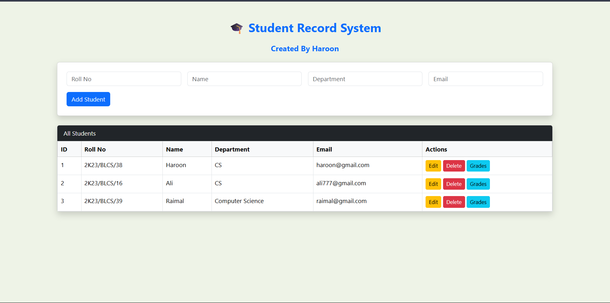
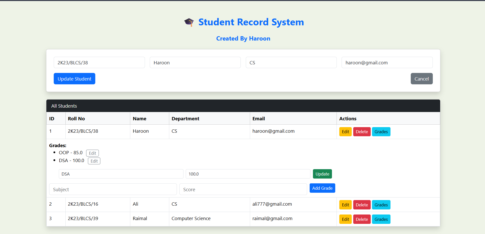

### ✅ `README.md`

````markdown
# 🎓 Student Record System (Flask CRUD App)

A simple and user-friendly Student Record Management System built with **Flask**, allowing you to manage students and their subject-wise grades.

---

## 📌 Features

- ✅ Add, Edit, and Delete Students
- ✅ Add and Edit Grades per Student
- ✅ Duplicate checks for Roll Number and Email
- ✅ Clean Bootstrap UI with flash messages
- ✅ Edit forms with cancel option
- ✅ Grade editing with collapsible inline forms


## 🛠️ Tech Stack

- **Backend**: Flask, SQLAlchemy
- **Frontend**: HTML, Bootstrap 5
- **Database**: SQLite (or switchable to MySQL/PostgreSQL)

---
````


---

## 📸 Screenshots

### 🧑‍🎓 Student List & Add Form


### ✏️ Edit Student / Grade


---
## 🚀 How to Run

### 1. Clone the Repository
```bash
git clone https://github.com/your-username/student-record-system.git
cd student-record-system
```

### 2. Create & Activate Virtual Environment

```bash
python -m venv venv
source venv/bin/activate  # On Windows: venv\Scripts\activate
```

### 3. Install Dependencies

```bash
pip install -r requirements.txt
```

### 4. Run the App

```bash
python run.py
```

Open `http://localhost:5000` in your browser.

---

## 🧾 Project Structure

```
student-record-system/
│
├── run.py
├── instance/
├── Components/
│   ├── __init__.py
│   ├── routes.py
│   ├── models.py
│   └── templates/
│       └── index.html
├── static/
└── README.md
```

---

## 📋 Requirements

```
Flask
Flask-SQLAlchemy
```

Create `requirements.txt` with:

```bash
pip freeze > requirements.txt
```

---

## 🙌 Author

**Haroon Khan**
💼 [GitHub Profile](https://github.com/RealHaroon)


---

## 📄 License

This project is licensed under the MIT License.

---

```

---

