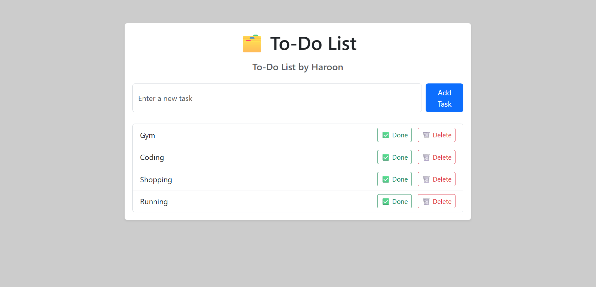

---

```markdown
# ✅ Flask To-Do List App

A simple and stylish **To-Do List web app** built using **Flask**, **SQLite**, and **Bootstrap 5**. Users can add, complete, and delete tasks with data stored persistently in a local database.

---

## 🚀 Features

- 📝 Add new tasks
- ✅ Mark tasks as complete
- 🗑️ Delete tasks
- 💾 Data saved in SQLite database
- 🎨 Clean Bootstrap UI with translucent purple background

---

## 🛠️ Tech Stack

- **Backend**: Python, Flask, SQLAlchemy (ORM)
- **Database**: SQLite
- **Frontend**: HTML5, Bootstrap 5, Jinja2 Templating

---

## 📁 Project Structure

todo-flask/
│
├── app.py              # Main application logic and routes
├── models.py           # Database model for Task
├── templates/
│   └── index.html      # Main UI template
├── todo.db             # Auto-created SQLite database
└── README.md           # Project description

````
```


---

## 💡 How to Run

### 1. Clone the Repository

```bash
git clone https://github.com/yourusername/todo-flask.git
cd todo-flask
````

### 2. (Optional) Create Virtual Environment

```bash
python -m venv venv
venv\Scripts\activate  # Windows
source venv/bin/activate  # macOS/Linux
```

### 3. Install Dependencies

```bash
pip install flask flask_sqlalchemy
```

### 4. Run the App

```bash
python app.py
```

Visit: `http://127.0.0.1:5000/` in your browser.

---

## 📸 Screenshots




---

## 📌 Future Improvements

* Add task categories or priority
* User authentication
* Edit task functionality
* Responsive design for mobile

---

## 🧑‍💻 Developed By

**Haroon Khan**
GitHub: [@RealHaroon](https://github.com/RealHaroon)

---

## 📄 License

This project is licensed under the MIT License.

```

---
